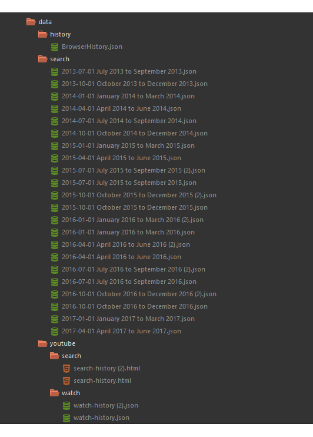

# Search Analytics
Pranshu Gupta

## Analyzing Online Activity from Google Search and Browsing Data
The way we use search engines can tell many things about us. This is a set of python programs that we can use to analyze our own search data and draw some useful insights from the same.

## Read the Article here
http://pranshu258.github.io/blogs/digitalfootprint

## How to use?
+ Download your Google Data (Search and Browser) in JSON format
+ Extract the JSON data and put it in a folder structure like this (see figure):

+ Install Python 3 (if you haven't already)
+ Install the Wordcloud Package `sudo pip3 install wordcloud`
+ Install numpy package `sudo pip3 install numpy`
+ Install Matplotlib `sudo pip3 install matplotlib`
+ Run `python3 words.py`
+ Run `python3 wordcloud.py`
+ Run `python3 history.py`
+ Run `python3 historychart.py`
+ Run `python3 hourlyactivity.py`
+ Run `python3 dailyactivity.py`
+ Run `python3 youtubehistory.py`
+ YouTube history may include many useless words like 'Official', 'Video', 'Deleted', 'Private' etc. Please remove any such words which you consider irrelevant.
+ Run `python3 youtubewordcloud.py`

